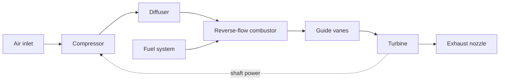
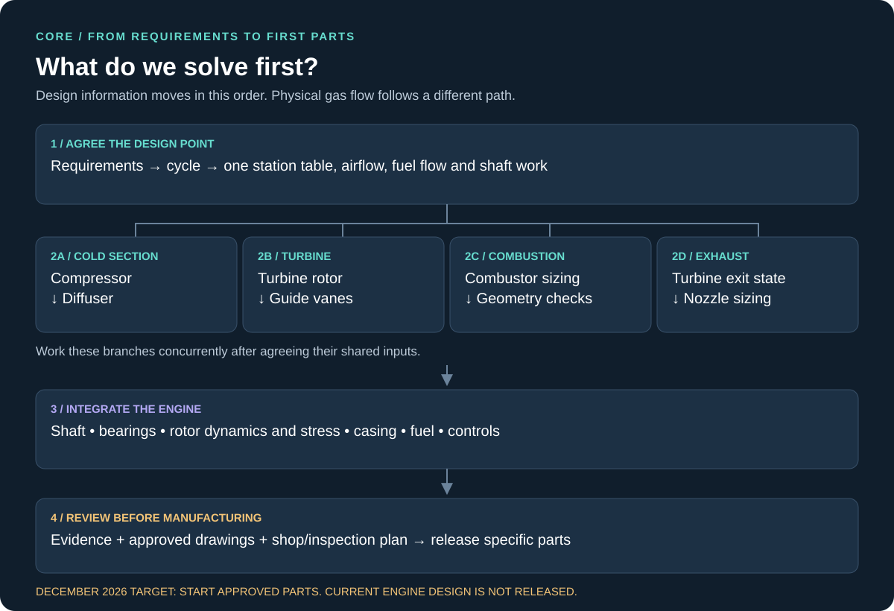

# CORE · reverse-flow microjet

CORE (Compact Operational Research Engine) is an RSS student project. Design a student-built reverse-flow microjet, understand each subsystem, and begin manufacturing **reviewed parts by December 2026**.

**Current status: preliminary design, not released for manufacture or engine testing.** The corrected model exposes a critical-speed separation failure. Passing software tests establishes numerical consistency; it does not establish that the engine will work.

## Start here

1. Read the [team workflow](docs/workflow.md).
2. Follow the [component design order](docs/design-order.md).
3. Pick an [issue](https://github.com/Rensselaer-Spaceflight-Society/CORE/issues), record a primary owner and independent reviewer, and work on a branch.
4. Assign work from the [team task backlog](docs/team-tasks.md). Use the [fall timeline](docs/fall-2026.md) and [model review](docs/model-review.md) to identify the next evidence needed.

## How the engine works



The combustor routes air around the liner and turns the hot flow back toward the turbine. These arrows show component sequence, not a scaled cross-section.

## In what order do we design it?



**Turbine sizing comes before guide-vane sizing:** the turbine determines the incoming swirl it needs. The [complete generated dependency graph](docs/generated-dependencies.md) comes directly from module inputs and outputs.

## Run the model

Python 3.11–3.13:

```bash
python -m pip install -r requirements.txt
python -m pytest
python run.py --report-only
python run.py --graph --report-only
python run.py --status
```

Reports go into `out/`: total station conditions, shared state, preliminary cold liner dimensions, and a readiness report listing failed limits and missing evidence. `python run.py` returns failure when numerical limits fail. `--report-only` deliberately returns success for diagnostic generation. **Never use that flag to authorize hardware.**

`cad_dims.json` schema 2 includes release status, design fingerprint, `dimensions_mm` and separate `hole_counts`. The two-column `cad_dims.csv` is an import convenience; keep it with its JSON metadata and readiness report.

```bash
python run.py --release-check
```

The release check additionally requires current reviewed evidence in `config/readiness.yaml`; it is intentionally blocked today. Final hardware approval requires named reviewers and the applicable shop/test authority. [Details](docs/model-review.md#release-evidence).

## Where things live

| Folder / file | Purpose |
|---|---|
| `config/seed.yaml` | Chosen design point and provisional assumptions |
| `config/limits.yaml` | Existing screening thresholds; changes require Safety review |
| `core/` | Shared equations, contracts, solver and readiness checks |
| `modules/` | One owner for each calculated engineering quantity |
| `tests/` | Conservation checks and regression/failure tests |
| `docs/` | Workflow, diagrams, limitations and semester plan |
| `legacy/v5/` | Original GitHub V5 script, preserved as history |
| `V22_CombustionChamberDesign.py` | Compatibility interface; current pipeline is `run.py` |
| `RPM_Sweep_OffDesign.py` | Prescribed-point combustor screening, not matched engine off-design |

The embedded bare Git backup was removed from the working tree; its contents remain in Git history. The existing MIT license is retained.
