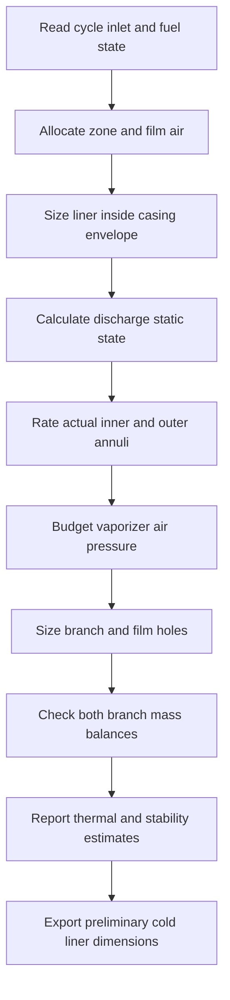

# Component design and solve order

The cycle starts from assumed efficiencies and a thrust target. It sizes airflow to that target; reproducing the thrust downstream is an internal consistency check.

| Step | Team work | Required input | Hand-off |
|---|---|---|---|
| 1 | Requirements and cycle (M01) | Mission, environment, thrust, speed, temperature/pressure assumptions | Station table, air/fuel flow, compressor/turbine work |
| 2A | Compressor → diffuser (M10 → M11) | Cycle work, speed, airflow | Flow path, envelope and local states |
| 2B | Turbine → guide vanes (M13 → M12) | Turbine work, hot flow, speed, reaction | Rotor annulus, shared blade mass/centroid, swirl and effective NGV area |
| 2C | Combustor → diagnostics (M20 → M24) | Actual cycle inlet/fuel state, casing envelope | Frozen liner, branch air budgets, local injection heads, cold dimensions |
| 2D | Nozzle (M40) | Turbine exit total state and hot flow | Flow regime, area and thrust closure |
| 3 | Shaft, bearings, dynamics, stress, casing and fuel (M30–M34, M50) | Component dimensions, mass and load estimates | Integrated fits, loads, pressure budget and identified gaps |
| 4 | Evidence and drawing review | Component tests, supplier data, material/process review | Part-specific manufacturing package or explicit blocker |

Steps 2A–2D can progress concurrently after shared inputs are agreed. Their physical interfaces still need joint review. This table groups engineering work; the [generated module graph](generated-dependencies.md) gives the exact software order.

## Combustor calculation order

Uniform liner static pressure is a lumped assumption. The model does not resolve progressive air withdrawal, recirculation, droplet evaporation, finite-rate chemistry or a temperature field. Cold-flow and combustion-rig evidence must establish those behaviors.
