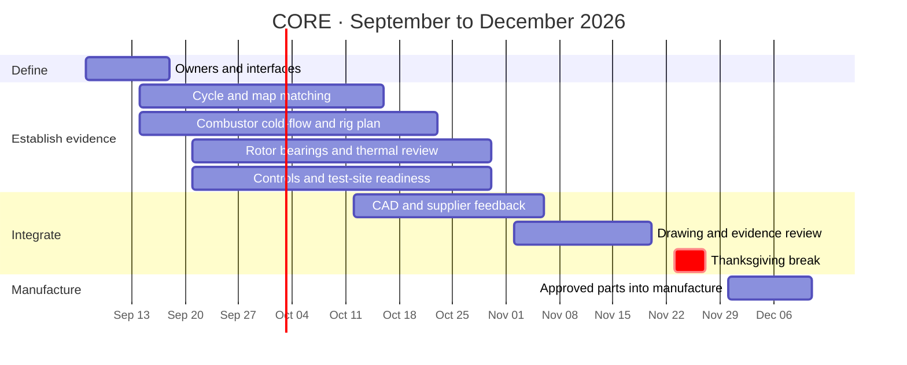

# Fall 2026 · first reviewed parts into manufacturing

**Target: begin manufacturing approved parts by December 11, 2026.** This is a start-of-manufacturing milestone, not an operating-engine promise. Shop access, procurement and technical approval control the actual part list.

| Review | Due | Acceptance criterion |
|---|---|---|
| A · Requirements and ownership | September 18 | Primary/reviewer per subsystem; operating envelope, interfaces, first-part scope |
| B · Feasibility evidence | October 16 | Map/cycle assumptions reconciled; pressure-budget and rotor/bearing evidence plan reviewed |
| C · Integrated design | November 6 | Common CAD interfaces, thermal fits, evidence, suppliers and shop capability reviewed |
| D · First-part release | November 20 | Approved revision, drawings, tolerances, material/process and inspection plan per part |
| Manufacturing starts | November 30–December 11 | Shop accepts released packages; first operations and inspections logged |

If a rotating/hot component lacks evidence at Review D, keep it blocked and consider independently reviewed fixtures or coupons. Do not release an unresolved engine part simply to meet the date.

RPI lists Thanksgiving break November 23–27, last classes December 11 and exams December 16–22. This schedule keeps the manufacturing start ahead of exams; shop availability remains to be confirmed. [RPI academic calendar](https://registrar.rpi.edu/academic-calendar).
