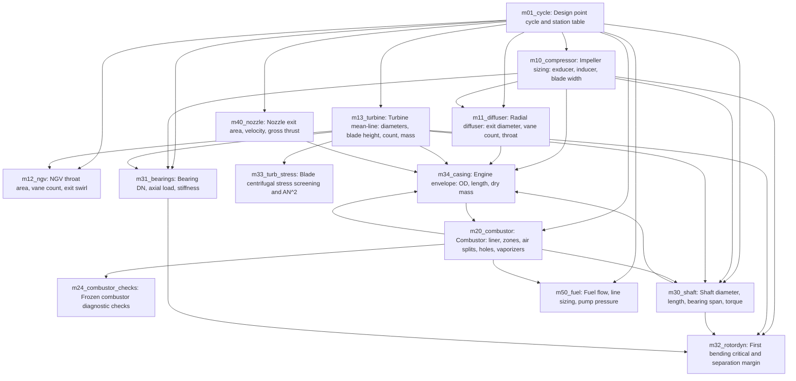

# Generated module dependencies

Generated from `reads` and `writes`; arrows mean information flow, not gas flow.

Regenerate with `python scripts/generate_dependencies.py`.



## Execution order

```text
  1. m01_cycle
  2. m10_compressor
  3. m11_diffuser
  4. m13_turbine
  5. m12_ngv
  6. m40_nozzle
  7. [iterate to convergence: m30_shaft, m34_casing, m20_combustor]
  8. m24_combustor_checks
  9. m31_bearings
 10. m32_rotordyn
 11. m33_turb_stress
 12. m50_fuel
```

Independent branches may be designed concurrently. No calibrated component-efficiency feedback currently exists.
