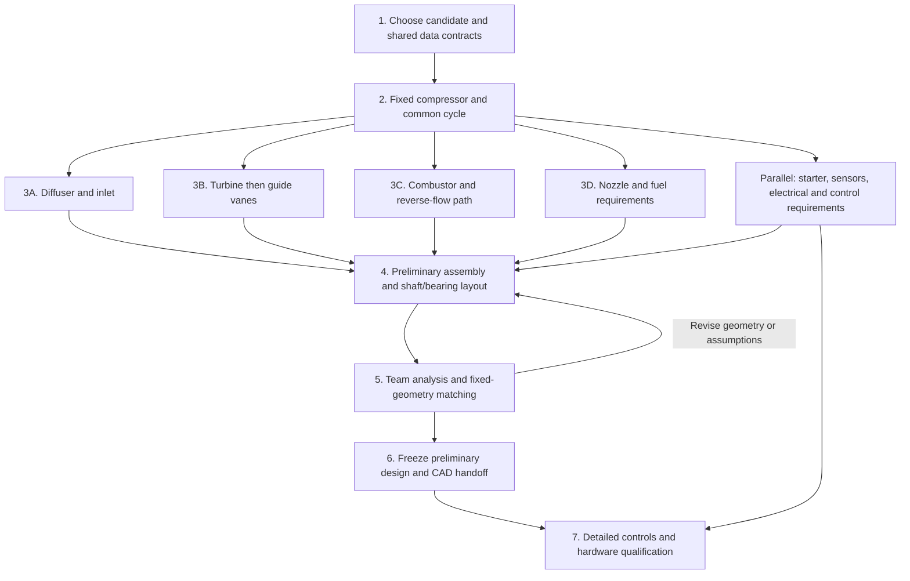

# CORE preliminary design and integration roadmap

Surveyed October 4, 2026, against local `github-core` commit `98c4167`.

**Subsequent handoff update:** the user set a **$5,500 target and $6,000 maximum cash ceiling**. The October 2 itemized budget records a purchased turbine wheel/guide-vane casting route and estimates $6,602 before conditional savings. See the [overnight handoff](overnight-handoff/00-START-HERE.md) for these newer planning inputs, their source qualifications and the detailed implementation assignment. They supersede older budget amounts for that assignment.

The next milestone should be **one internally consistent engine definition that the team can turn into a complete preliminary CAD assembly**. The existing pipeline is a useful foundation. Most remaining work concerns actual component definitions, interfaces, and importing engineering results. A larger collection of independent sizing scripts would not close those gaps.

This roadmap follows the proposed division of work: agents implement the connecting software; the team owns engineering analysis, component choices, CAD, and acceptance. DP-2 is treated as the leading candidate described in the repository, not as an already accepted design.

## What exists today

The active working repository is `github-core`. The neighboring `core-engine` directory is an older snapshot; `tmp/combustor-dp2-publish` is another checkout. Use one authoritative repository for subsequent development. This survey covers the local source and supporting project records; remote issues, unpublished analysis and external CAD were not audited.

| Item | Observed state |
|---|---|
| Calculation framework | Shared gas/thermodynamic functions, declared module inputs/outputs, single producer per computed variable, dependency ordering, coupled iteration, registry and numerical validation |
| Engineering modules | 14 total: 11 `draft`, 3 `stub`, 0 `verified`; these are declared maturity labels, not percentages of completion |
| Verification run | `python -m pytest -q`: **163 passed** on Python 3.13; includes learning-platform tests as well as engineering tests |
| Dependency check | `python scripts/generate_dependencies.py --check`: passed |
| Baseline execution | `python run.py --graph --report-only`: completed; **15/16 numerical screens pass** |
| Existing failure | Critical-speed separation approximately **10.03%**, versus the configured **20%** criterion; startup crossing also reported |
| Evidence records | All 10 required categories pending, plus unmatched/pending design fingerprint: 11 reported evidence blockers |
| CAD output | 35 scalar dimensions in `cad_dims.csv/json`, plus selected hole counts in JSON; no native CAD or STEP files found in the surveyed repository |
| Supporting work | Project reviews, task cards, worksheets and a guided learning platform; these are not finished engineering modules |

The runnable baseline is still **250 N, PR 3.2, 0.484 kg/s and 66,000 rpm**, producing approximately **125.1 mm compressor diameter and 184.4 mm casing OD**. It is not the DP-2 candidate with a roughly 76 mm purchased wheel and 152.4 mm casing. Baseline rotor results cannot be relabeled as DP-2 results.

The DP-2 cycle screen uses 6% combustor loss; the standalone DP-2 combustor uses 4%. Both are prescribed assumptions. Neither is currently a common, fully integrated DP-2 engine configuration.

Source anchors: [README](../README.md), [model review](model-review.md), [DP-2 review](project/dp2-review.md), [DP-2 combustor changes](combustor-dp2.md), [seed](../config/seed.yaml), [runner](../run.py).

## Work remaining by subsystem

“Team input” means a decision, analysis result or component definition to be supplied by the engineering team. Agents can implement an interface before those results exist, but missing results must remain explicit.

| Area and current code | What is implemented | Agent implementation remaining | Team input needed for preliminary CAD |
|---|---|---|---|
| Design configuration / M01 | Cycle with assumed efficiencies; airflow sized backward from thrust; turbine work imposed from compressor demand | Named configurations; separate thrust-sizing and prescribed-flow/fixed-component modes; input provenance; one common station table; explicit station and loss boundaries | Chosen candidate, exact wheel, operating cases, assumptions and loss allocation |
| Compressor / M10 | Euler/slip sizing, inducer continuity, preliminary exit state and estimated mass | Fixed purchased-wheel adapter; map/data ingestion with reference conditions; distinguish fixed geometry from calculated performance; accept actual mass/inertia and attachment dimensions | Exact part geometry, applicable map or team rating, material/supplier data and mounting interface |
| Diffuser / M11, stub | Diameter ratio, velocity ratio, effective area and fixed provisional vane count | Consume team geometry/performance; publish channel/throat/exit geometry and state; connect loss or recovery to the common pressure budget | Vaneless gap, passages, widths, vane definition, outlet/reverse-turn layout and analysis |
| Turbine / M13 | Mean-line annulus, approximate blade count, simplified blade/disc mass and inertia | Export full triangle and geometry data; import blade sections, disc/bore details and CAD mass properties; connect team flow-capacity/loss results | Blade geometry, metal angles, chord/thickness, attachments, material/process, thermal and structural analysis |
| Guide vanes / M12 | Required swirl, effective flow area, vane count and local state | Carry actual vane sections, span, chord, stagger, blockage, throat definition and interfaces; connect loss/flow-capacity data | Vane profile and row layout; review of local throat capacity and rotor inlet match |
| Combustor / M20 + library | Most developed geometry model: liner dimensions, zones, air allocation, holes, vaporizers, local pressure budgets and cold liner surfaces | Expose latest DP-2 options through the engine registry; separate wall inputs; preserve inner/outer counts; export complete row/tube coordinates and diagnostics; connect upstream/downstream boundaries | Adopted loss/air split, stock thickness/material, dome/turn/exit shape, hole placement, tube layout, mounts and expansion strategy |
| Combustor checks / M24, stub | Publishes diagnostics from the same M20 geometry; no second sizing pass | Import and associate team thermal, buckling, flow and stability results with exact geometry; distinguish assumptions from supported results | CFD/thermal/structural results and, later, component-test evidence |
| Shaft / M30 | Torsional diameter, uniform shaft mass, axial length from empirical proportions and fractional bearing span | Stepped shaft/axial-station representation; explicit shoulders, seats, spacers, retention and load locations; analysis input/output adapters | Actual assembly stack, wheel attachments, bearing locations, loads, fits and shaft analysis |
| Bearings / M31 | DN screen, approximate net axial force, supplied constant stiffness | Exact component records; locating/floating/preload arrangement; load cases, lubrication requirements and stiffness/damping inputs; housing/seat interfaces | Selected bearing, supplier conditions, preload/lubrication arrangement, load and fit analysis |
| Rotordynamics / M32, stub | One undamped lumped critical-speed estimate | Exchange actual shaft, rotor masses/inertias, supports and damping with the team's analysis; import modes, Campbell results and response margins by revision | Supported-rotor analysis, startup crossing assessment and balancing plan |
| Rotor strength / M33 | Centrifugal blade-root screening from M13 blade mass/centroid | Import combined rotor/disc/blade results, load cases and material/life basis; connect result identity to geometry | Disc/impeller/blade stress, thermal stress, attachments, fatigue/creep and process assessment |
| Casing / M34 | Maximum envelope, rough overall length and shell/accessory mass estimate | Part/assembly breakdown; local shrouds, tunnel, bearing housing, flanges, mounts, ports and clearance checks; actual mass/CG aggregation | Assembly layout, support scheme, pressure/thermal analysis, fastening/sealing and fabrication choices |
| Nozzle / M40 | Exit area, diameter, velocity and thrust closure | Complete inlet/exit interface, contour/length and attachment parameters; fixed-geometry rating and imported loss data | Nozzle shape, wall/material, transition, mount and analysis |
| Fuel / M50 | Required flow, line bore, line/filter/minor-loss budget and absolute/differential pump pressure | Selected pump/drive/injector data; line/manifold network and operating points; mounting and signal interfaces | Hardware selection, actual routing/fittings, curves, fuel distribution and compatibility review |
| Inlet, seals, lubrication, starter and instrumentation | Assumed allowances or task cards; no dedicated integrated component models found | Component/interface records, flow/power allocations, attachment geometry, port locations and supporting analysis adapters | Inlet geometry, sealing/lubrication concept, start method, sensors and access requirements |
| Controls, electrical and DAQ | Learning worksheets and planning material; C4 explicitly contains no control logic | Signal dictionary, executable simulation/state machine, plant interface, fault scenarios, logging and hardware adapters after hardware selection | Requirements, operating limits, sensor/actuator selections, power architecture and engineering-reviewed behavior |
| Whole-engine rating | Standalone combustor sweep with prescribed PR/flow/TIT | Frozen-geometry engine rating that closes common-speed flow, pressure and shaft power; then startup/transient interfaces | Compressor/turbine performance data, mechanical losses and starter/fuel characteristics |

Module sources: [modules](../modules/). Analysis assignments in [shaft](../workspaces/structures/Shaft/Shaft.md), [bearings](../workspaces/structures/Bearings/bearings.md) and [rotordynamics](../workspaces/structures/Rotordynamics/Rotordynamics.md) are written tasks, not integrated implementations. The unfinished structures object example is outside the tested production pipeline.

## Connections that should be resolved first

1. **Purchased wheel versus calculated wheel.** M01 chooses mass flow from thrust; M10 chooses wheel dimensions from cycle work. Installing DP-2 requires a mode that holds the selected hardware fixed. Merely editing PR, rpm and thrust can still produce a different wheel. Keep the existing sizing mode as a regression case.

2. **One pressure and power budget.** M11 currently does not reduce a downstream total pressure; the cycle supplies the pressure state before geometry is designed. Define what compressor-map efficiency includes, where diffuser/turn losses begin, and where combustor/NGV/turbine/nozzle boundaries lie. Make the mechanical-loss accounting explicit as well. Component analyses should update that common budget without duplicate losses.

3. **Bring the latest combustor behavior through M20.** The common library already supports inner-hole K sizing, separate casing/liner/tunnel walls and asymmetric dilution counts. M20 does not expose that full input set, hardcodes 316SS and uses casing wall thickness as the legacy wall input. Its single `n_holes_dil_count` takes the outer count, so it cannot faithfully represent DP-2's 24-inner/32-outer arrangement. Preserve both sides and expose the new spacing/scoop diagnostics before exporting a DP-2 assembly.

4. **Replace estimated packaging with explicit assembly stations.** M30 estimates diffuser length from compressor diameter and turbine length from blade height; M34 adds proportional inlet/nozzle allowances. Neither defines where real faces mate. Establish an axis, axial datum, angular reference and part interfaces before detailed part CAD.

5. **Allow engineering results to replace estimates without competing writers.** M10/M13 currently produce approximate mass properties. Add an explicit calculated-versus-imported source selection behind one producer, with revision checks. Do the same for losses, thermal growth, bearing coefficients and structural margins.

6. **Separate scalar state from geometry and analysis artifacts.** The current module contract accepts numbers/bools, not blade-coordinate arrays, tables or CAD objects. Preserve that useful scalar contract and add versioned supporting files with units, source identity and validation. Extend fingerprint coverage to those files; the current fingerprint does not automatically cover arbitrary future map/CAD/result artifacts.

Source anchors: [M01](../modules/m01_cycle.py), [M10](../modules/m10_compressor.py), [M11](../modules/m11_diffuser.py), [M20](../modules/m20_combustor.py), [M30](../modules/m30_shaft.py), [M34](../modules/m34_casing.py), [module contract](../core/module.py), [readiness](../core/readiness.py).

## General completion order

This is the engineering completion order, not the exact order Python executes modules. Some work should proceed concurrently after its interfaces are agreed.

| Order | Work and useful completion condition |
|---|---|
| **1. Establish the design basis and contracts** | Select the candidate and fixed/purchased components; record unresolved assumptions. Define component IDs, station names, datums, units, source/revision fields and analysis exchange formats. Freeze the format early; preliminary numbers may still change. |
| **2. Produce one executable candidate engine** | Add configuration selection and fixed-wheel/prescribed-flow support. Reconcile cycle and combustor assumptions. Every output identifies its configuration, and component runs reproduce the same inlet/fuel states. Missing map evidence remains visible. |
| **3. Complete component interfaces in parallel** | Compressor → diffuser/inlet; turbine → NGV; combustor; nozzle/fuel. Publish geometry envelopes, mating faces, local states, loads and uncertainty. Start bearing, starter and fabrication selection here because they constrain geometry. |
| **4. Assemble the preliminary layout** | Team builds skeleton CAD while agents implement explicit axial/radial interfaces, fits, counts and parameter exports. Define the actual stepped shaft, bearing support, shrouds, tunnel, transitions, mounts, ports and access. Feed CAD mass/inertia back into the model. |
| **5. Close the analysis/layout loop** | Team runs aerodynamic, structural, thermal and rotor analyses; agents import results and regenerate comparisons. Rate the same frozen geometry at the chosen operating cases. Reconcile flow/power capacity and revise layout before detailing geometry that depends on it. A converged sizing calculation alone does not demonstrate self-sustain. |
| **6. Freeze the preliminary CAD handoff** | One revision contains the station/load tables, component definitions, complete assembly interfaces, preliminary BOM, parameter pack, analysis references and an explicit unresolved-items list. Team checks the CAD against this pack. This is the requested preliminary-design milestone. |
| **7. Continue to manufacture/test readiness** | Detailed control implementation, calibrated plant/startup behavior, complete drawings/tolerances/processes, component tests, and part-specific release evidence. Preserve the repository's existing distinction between a preliminary design and released hardware. |

You can begin **skeleton/envelope CAD during steps 2–3**. Detailed shaft seats, attachments, blade/vane geometry and thermally sensitive fits should follow the relevant step 4–5 decisions. Sensor bosses, starter space, fuel access and wiring routes belong in the layout early, even while control software is unfinished.

## Suggested agent work packages

These are proposed implementation assignments, not agents dispatched by this survey. The engineering team supplies the analysis and reviews the imported meaning of each quantity.

| Package | Dependency | Concrete deliverable and completion check |
|---|---|---|
| **A. Configuration and interface foundation** | Start first | Named case loading, station conventions, source metadata and geometry/result schemas. Old baseline still reproduces; missing or conflicting inputs fail explicitly. |
| **B. Fixed compressor and cycle integration** | A | Fixed-wheel adapter and prescribed-flow cycle mode; map/rating import format. Selected wheel dimensions remain unchanged through a run; station/mass/energy bookkeeping agrees. |
| **C. DP-2 combustor integration** | A, then B for common case | All intended library controls available through M20; independent counts/walls; shared configuration and diagnostic export. Standalone and pipeline runs agree when given identical inputs. |
| **D. Turbomachinery and flow-path interfaces** | A/B | Diffuser, turbine, NGV and nozzle geometry/performance adapters, station transitions and loss ledger. Team-supplied results propagate once with correct units and boundaries. |
| **E. Assembly, shaft and bearing integration** | A; iterates with C/D | Explicit station stack, part interfaces, support properties, mass/inertia imports and geometric checks. Assembly exports no longer depend on undocumented length proportions. |
| **F. Engineering-result and rating integration** | A; substantive cases need B–E | Revision-aware thermal/structural/dynamics imports plus fixed-geometry operating-case runner. Stale analyses are flagged; numerical residuals and unsupported cases are visible. |
| **G. CAD handoff and preliminary review pack** | Define schema in A; finish after C–F | Per-part dimension/angle/count tables, datums, cold/hot tags, assembly interfaces and change report. No lost inner/outer counts or silent unit conversion; team verifies CAD consumption. |
| **H. Fuel, starter, electrical and controls interfaces** | Requirements in parallel with B; implementation as hardware is chosen | Selected component records, signal dictionary, power/flow budgets, simulated controller/plant interface and logging. Use synthetic tests until engineering requirements and hardware are supplied. |

An integration owner should own shared schemas and the assembled run. Component agents should submit small changes against those contracts. Start with **A + B**, then **C/D/E** in parallel, then **F/G**; start H's packaging and signal requirements early. Avoid asking every component agent to invent a different configuration, exporter or analysis-result format.

## Minimum preliminary CAD package

The existing [CAD map](../config/cad_map.yaml) and [exporter](../run.py) provide a starting point, but the exporter currently assumes every mapped number is a length and multiplies it by 1,000. Angles, counts, mass properties and coordinate arrays need explicit handling.

Before calling the preliminary handoff complete, supply:

- A selected design revision and a single consistent station/flow/power/loss table, with assumptions and operating-case bounds.
- Part IDs and a preliminary make/buy BOM, including bearings, seals, fasteners, fuel fittings, starter and instrumentation interfaces.
- Assembly origin/axis, mating faces and a complete axial/radial stack with bearing and rotor positions.
- Component geometry definitions sufficient for the team's CAD work: blade/vane sections or referenced team CAD, passage/transition outlines, liner row positions and clocking, vaporizer centerlines, nozzle contour, seats and attachments.
- Parameters with units, temperature/reference condition, source, revision and uncertainty; preserve distinct inner/outer quantities.
- Actual CAD-derived masses, centers of gravity and inertias where available, with estimates explicitly identified elsewhere.
- Team analysis references and the corresponding geometry revision; a list of unresolved details and which downstream parts they affect.

A preliminary configuration can remain explicitly provisional where tests are still needed. It should not contain unresolved contradictions about wheel size, material, hole counts, station pressures or attachment geometry.

## Work that can wait, and work that cannot

The learning platform, teaching explorer, expanded lessons, cosmetic dashboards, automated CAD rebuild plugins and broad optimization studies are outside the critical path to this milestone. Retain the existing material, but prioritize engineering interfaces over further educational tooling. The September agent handoff pack mainly assigns teaching applications; it should not be reused unchanged as the implementation backlog for this pivot.

Full calibrated transient simulation and completed firmware need not block first layout CAD. Their hardware interfaces and space/power requirements do need early decisions. Likewise, extensive engine qualification follows preliminary design, but rotor support feasibility, thermal-clearance strategy and plausible fixed-geometry flow/power matching must influence the preliminary geometry.

Some comments still describe removed or superseded behavior: an outer efficiency-refinement loop in `core/solver.py` and `config/seed.yaml`, and dynamic CLP-based efficiency in the RPM sweep header. Update those alongside the relevant work so agents do not implement from stale descriptions. The historical `docs/HANDOFF.md` is explicitly superseded.

The immediate next deliverable should be **a common candidate configuration, a fixed compressor definition and the shared geometry/analysis contracts**. Those let agents connect useful component work while the team advances the actual analysis and CAD.
