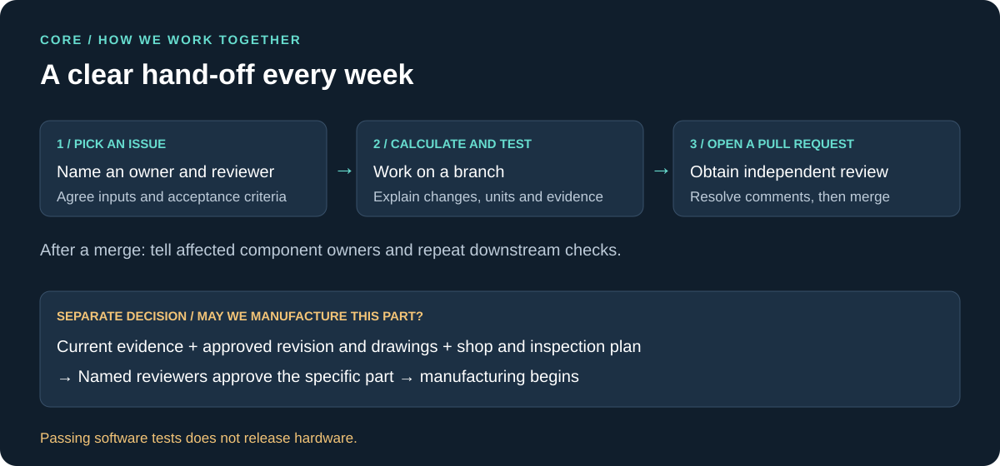
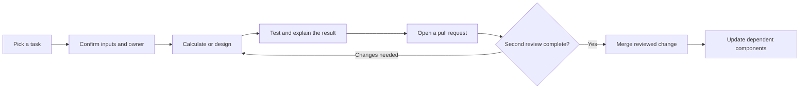
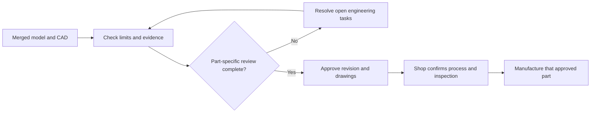

# Team workflow

**One issue → one owner → a reviewable result → a second-person review.**

At the weekly meeting, each component owner gives three facts: what changed, what evidence supports it, and what input or decision is needed next. When an upstream number changes, downstream owners repeat the affected checks.

## A software merge is not a part release

The engine-level release check is blocked. A non-running fixture or coupon can have a narrower review package; that does not release a rotor, hot section or complete engine.

## Meeting agenda · 30 minutes

| Minutes | Topic | Leave with |
|---|---|---|
| 0–5 | Mission and December outcome | Definition of first manufactured parts |
| 5–10 | Engine path and design order | Agreed interfaces |
| 10–20 | Combustion, rotating assembly, controls/test readiness | Top blockers and evidence needed |
| 20–27 | Assign this week's tasks | Owner, reviewer and acceptance criterion |
| 27–30 | Confirm next review | Date and required deliverables |
