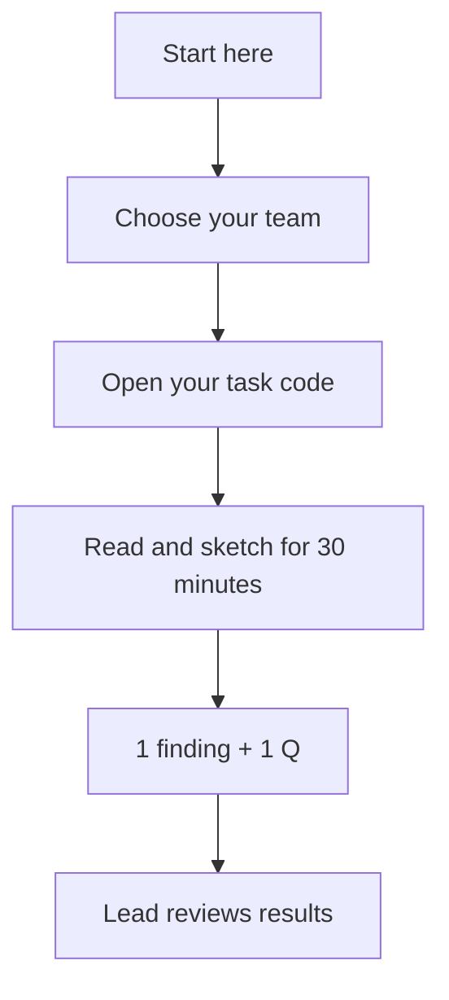

# Start here: your first CORE meeting

**Our mission:** learn how to build a reverse-flow microjet that runs and self-sustains. Performance is secondary. December 2026 target to manufacture parts - Spring 2027 is assembly and testing.

You do not need to know Git, Python, CAD or turbine theory before this meeting. Your lead will give you a task code. Open your team below, then that code. Spend 30–45 minutes learning one small thing and recording it in the card's Findings section.

| Team | Task codes | Start page |
|---|---|---|
| Turbomachinery | T1–T5 | [Turbomachinery](turbomachinery/README.md) |
| Combustion & systems | C1–C7 | [Combustion & systems](combustion-systems/README.md) |
| Structures | S1–S2 | [Structures](structures/README.md) |
| Safety | SAFE1, paired with T5 | [Safety](safety/README.md) |
| Chief engineer / coordination | Coordination lead | [Coordination](coordination/README.md) |

Only roles and task codes appear in these workspaces. The meeting facilitator keeps the person-to-code roster separately. GitHub account identities remain visible in commits and issues; these workspaces are not anonymous or a place for personal information.

## The three links you need today

1. [First-meeting agenda and engine introduction](meeting-1.md).
2. Your team's page above.
3. [DP-2 candidate and review](../docs/project/dp2-review.md). Read the short candidate table first; the detailed review is for leads and follow-on work.

## A guided version of your card, in Python

Every task code also has a small Python worksheet: [start here](python/README.md). It explains what your component does, gives you the few words you need and one worked example, and provides labelled places to type in what you find. It will not crash before you fill anything in and it will not invent a number for you.

You do not need to know Python, and you do not need it installed to take part - `--form` prints a paper version, and [HOW-TO-RUN.md](python/HOW-TO-RUN.md) covers the routes that need no install and no account. The worksheets are optional; the card is still the authority on your assignment.

## Record a finding without installing anything

**Simplest route:** open a [first-meeting finding issue](https://github.com/Rensselaer-Spaceflight-Society/CORE/issues/new?template=meeting-finding.yml), enter your task code and paste your short answer. A lead can copy the reviewed finding into your card. The new issue form becomes available after this change is merged; until then use a blank issue with the same fields.

**If you can edit the repository:** open your card, choose GitHub's pencil/Edit action, change only its Findings section, and propose a branch/pull request. Use the role code in the title, for example `T1: identify compressor map source`. Do not overwrite another card or the engine configuration.

**If GitHub is a barrier:** use paper or a shared document arranged under these same task codes. The lead collects the notes and publishes a reviewed summary after the meeting. No account setup should consume the whole workshop. Keep private rosters and supplier correspondence out of this public repository; link only material the team is allowed to publish. Large CAD belongs in the agreed CAD/Drive system, with a revision/link here.

Findings need: task code, date, source, what you learned, what is still unknown, and the next small step. `NOT FOUND` is a useful result. Neither a filled card nor a closed issue means a component is approved.

## Navigation after today

[Python worksheets](python/README.md) · [Shared interfaces](coordination/interfaces.md) · [Decisions](coordination/decisions.md) · [Budget and quote priorities](../docs/project/budget-cap.md) · [Engineering workflow](../docs/workflow.md)
