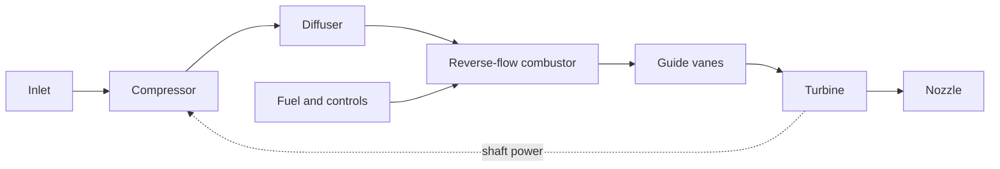

# Meeting 1: understand the engine, make one small contribution

**75 minutes.** Everyone starts with the same introduction. Leads choose optional stretch work only after a newcomer completes the basic task. The first meeting has no required purchases, machining, fuel handling, powered ignition or rotor operation.

| Minutes | Activity | Result |
|---|---|---|
| 0–10 | Chief engineer: mission, $5,000 cap, December first-parts goal | Agree what success means |
| 10–20 | Leads explain the engine using the diagram below | Everyone can follow air, fuel and shaft power |
| 20–25 | Explain candidate vs. checked vs. approved; choose task codes | One card per participant |
| 25–55 | Work with your sub-team; lead demonstrates the first example | A sketch, small table or arithmetic check |
| 55–65 | Each sub-team shares one finding and one unknown | Identify handoffs, not final designs |
| 65–75 | Leads review notes and agree one next step per card | Small follow-up with reviewer and date |

## What makes this an engine?

The compressor raises air pressure and consumes shaft power. The diffuser slows the air before the combustor. Fuel burns in the combustor, raising gas temperature while some pressure is lost. Guide vanes direct hot gas into the turbine. The turbine extracts shaft power to drive the compressor. The remaining gas leaves through the nozzle.

Reverse-flow describes the folded combustor path; the diagram shows function, not physical shape. Structures holds the parts in alignment. Instrumentation tells us what is happening. Safety reviews hazards and the conditions for any test.

**Self-sustaining** means the engine can run without starter assistance at a compatible, stable operating point. Enough turbine power, matching component flows, stable combustion and acceptable losses are all needed. Positive turbine-exit total pressure alone is not proof.

## Five words worth learning

| Word | Meaning for today's work |
|---|---|
| Mass flow | How much mass passes each second; use kg/s |
| Pressure ratio | Outlet total pressure divided by inlet total pressure; no units |
| Total vs. static | Total includes the effect of bringing flow to rest; do not mix the two |
| Interface | A shared dimension, load, signal or condition between two tasks |
| Evidence | A traceable source or measurement that supports a claim, with its limits |

DP-2 proposes 59–66 krpm, 0.30 kg/s, about 1.63 compressor pressure ratio, 1,150 K turbine inlet temperature and a 152.4 mm casing OD. These are **candidate values**. The current runnable seed still represents the earlier 250 N baseline. Do not copy DP-2's estimated idle speed into a controller or assume the solver has been migrated.

## What counts as finishing today?

One source or supplied example, three sentences in your own words, one unknown, and one next step. A clearly labeled sketch is enough. No one must independently select a bearing, approve material, solve the whole cycle or learn CFD today.

Leads own final technical decisions. They may pair people for learning, but should keep one primary card per person. T5/SAFE1 is one shared output, not two assignments. Respect each person's stated participation and lab-work preferences; keep those preferences in the private roster.

## Schedule correction

September 17, 2026 is **Thursday**, not Wednesday. The supplied cards also rename later gates compared with the published semester plan. For September 18, review the **candidate, evidence gaps and next decisions**, not an unsupported final sizing freeze. Leads should reconcile the schedule in the [decision log](coordination/decisions.md); until then the existing [fall plan](../docs/fall-2026.md) remains the published manufacturing schedule. The introductory tasks are due at this meeting's end, with unfinished items discussed with the lead rather than treated as failed design milestones.
